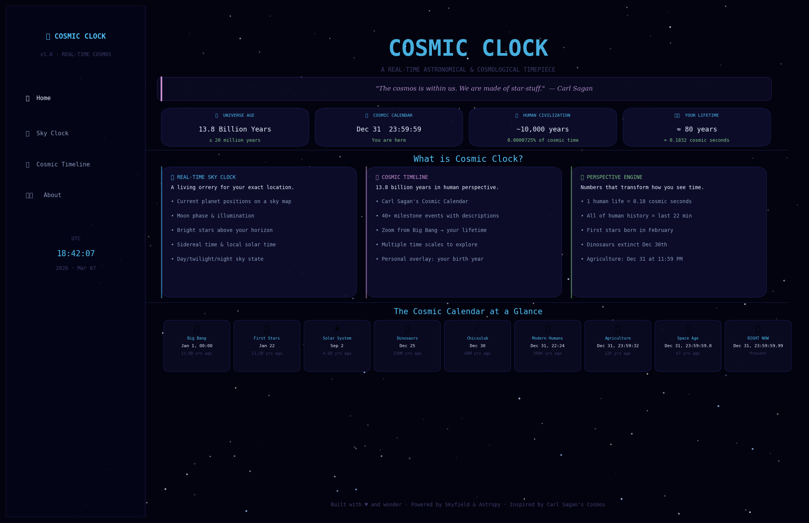
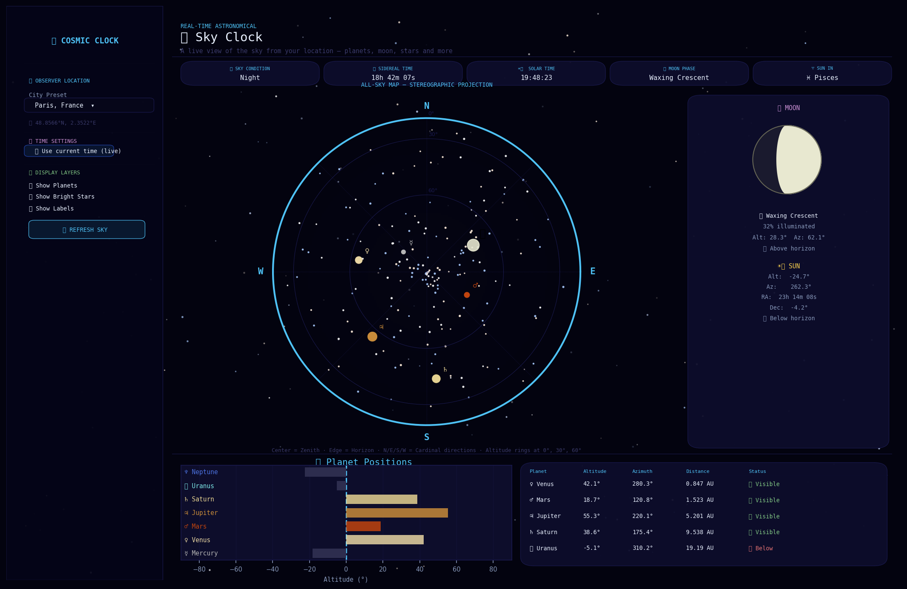
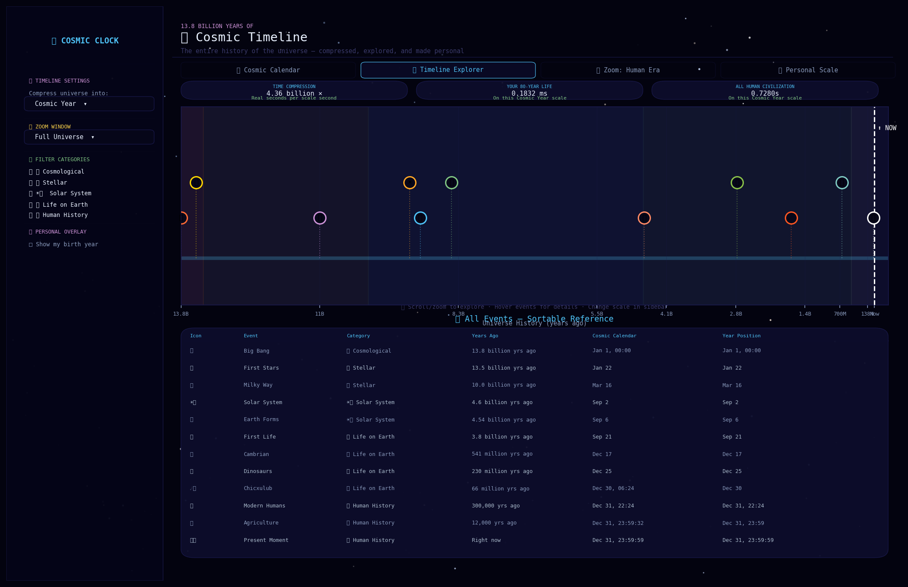
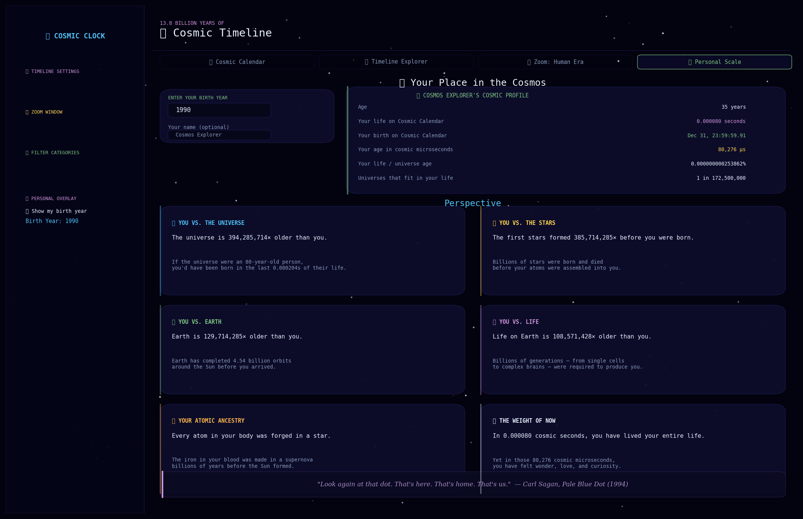

# 🌌 Cosmic Clock

**A Real-Time Astronomical & Cosmological Timepiece**

*"The cosmos is within us. We are made of star-stuff. We are a way for the universe to know itself."*  
— Carl Sagan

---

## Screenshots

### Home — Live Cosmic Dashboard


*The landing page with live UTC time, four key cosmic metrics, feature cards, and a quick-reference Cosmic Calendar strip.*

---

### Sky Clock — Real-Time All-Sky Map


*Stereographic all-sky projection showing planets, Moon (with phase diagram), and 34 bright named stars at accurate alt/az positions for your location. Planet altitude chart and coordinate table below.*

---

### Cosmic Timeline — 13.8 Billion Years Compressed


*43 milestone events on an interactive, zoomable timeline. Color-coded by category. Your 80-year life = 0.1832 ms on this scale. Sortable reference table lists all events with Cosmic Calendar dates.*

---

### Personal Scale — Your Place in the Cosmos


*Enter your birth year for a personal cosmic profile: your life in cosmic microseconds, when you were "born" on the Cosmic Calendar, and six perspective panels connecting your existence to deep time.*

---

## What is Cosmic Clock?

Cosmic Clock is an interactive web application that serves as a timepiece on two scales simultaneously:

1. **The Immediate Sky** — A real-time star map showing the current positions of the Sun, Moon, and all planets as seen from your location on Earth. Updated live.

2. **The Cosmic Scale** — The entire 13.8-billion-year history of the universe, compressed and made explorable. Where are *we* in the story of the cosmos?

The goal is to inspire the kind of cosmic wonder that comes from truly *feeling* deep time — not just knowing the numbers, but experiencing their weight.

---

## Features

### 🔭 Sky Clock (Real-Time)
- **All-sky stereographic map** showing the entire visible hemisphere at your location
- **Planets**: Mercury through Neptune with accurate positions (NASA JPL DE421 ephemeris)
- **Moon**: Phase, illumination percentage, rise/set status, graphical phase diagram
- **Sun**: Position, altitude, azimuth, day/twilight/night state
- **34 brightest stars** with alt/az, magnitude, and constellation data
- **Sidereal time**, local solar time, current zodiac sign
- **Date/time override**: Travel to any past or future sky view
- **Location presets**: 14 cities from New York to Mauna Kea, or enter custom lat/lon
- **Display layer toggles**: Planets, stars, labels independently controllable

### 🌌 Cosmic Timeline
- **Cosmic Calendar view**: Universe as a single year (Big Bang = Jan 1, Now = Dec 31)
- **Interactive timeline**: 43 milestone events from Big Bang to present
- **Multiple scales**: Compress universe into 1 year, 1 day, 1 hour, or 80 years
- **Zoomable**: From full universe → last 10,000 years
- **Category filters**: Cosmological, Stellar, Solar System, Life, Human History
- **Personal overlay**: Enter your birth year to see where your life falls
- **Cosmic Calendar Wheel**: Radial visualization of the year

### 🔬 Perspective Engine
- Nested zoom levels into the last cosmic second
- Human history events with precise cosmic calendar timestamps
- Your personal cosmic profile: life in cosmic microseconds
- Six perspective essays connecting your lifetime to cosmic history

---

## Installation

### Requirements
- Python 3.10 or higher
- pip

### Steps

```bash
# 1. Clone or download the project
git clone <repository-url>
cd Cosmic_Clock

# 2. (Recommended) Create a virtual environment
python -m venv venv
source venv/bin/activate    # Linux/macOS
# OR
venv\Scripts\activate       # Windows

# 3. Install dependencies
pip install -r requirements.txt

# 4. Run the app
streamlit run app.py
```

The app will open in your browser at `http://localhost:8501`.

### First Run Note
On first launch, Skyfield will automatically download the DE421 ephemeris file (~17 MB) from NASA JPL. This happens once and is cached locally. After that, the app runs completely offline.

---

## Running the App

```bash
streamlit run app.py
```

Navigate using the sidebar:
- **Home** (`app.py`) — Overview and quick facts
- **Sky Clock** — Real-time sky map
- **Cosmic Timeline** — Universe history explorer
- **About** — Credits and reference tables

---

## Project Structure

```
Cosmic_Clock/
├── app.py                          # Main entry point & home page
├── pages/
│   ├── 1_Sky_Clock.py              # Real-time sky map page
│   ├── 2_Cosmic_Timeline.py        # Universe timeline & Cosmic Calendar
│   └── 3_About.py                  # Credits, references, full Cosmic Calendar table
├── src/
│   ├── __init__.py
│   ├── astronomy.py                # Skyfield + Astropy position calculations
│   ├── timeline.py                 # Cosmic Calendar logic & event scaling
│   ├── visuals.py                  # Plotly figure generators
│   └── utils.py                    # CSS, formatting utilities, city presets
├── assets/
│   ├── events.json                 # 43 cosmic milestone events with descriptions
│   └── constellations.json         # 34 bright stars + zodiac data
├── requirements.txt
└── README.md
```

---

## Technical Details

### Astronomical Backend

| Component | Library | Notes |
|-----------|---------|-------|
| Planet positions | Skyfield + DE421 | Sub-arcsecond accuracy |
| Moon position & phase | Skyfield | Phase from ecliptic longitude |
| Sun position | Skyfield (with fallback) | Mean anomaly calculation fallback |
| Sidereal time | Astropy | IERS tables |
| Star catalog | Custom (Hipparcos-derived) | 34 brightest named stars |
| Coordinate conversion | Astropy + custom | Alt/Az from RA/Dec + LST |

### Design Choices

**Why Skyfield over pure Astropy?**
- Skyfield's observer API is more direct for alt/az conversions
- The DE421 ephemeris provides verified accuracy for all solar system bodies
- Cleaner moon phase computation via ecliptic coordinates
- No ERFA/SOFA issues on some platforms

**Why Streamlit?**
- Pure Python — no JavaScript required
- Native Plotly integration (interactive charts out of the box)
- Multi-page routing built-in
- Easy deployment to Streamlit Cloud

**Fallback mode**: If Skyfield or its ephemeris file is unavailable, the app degrades gracefully to simplified Keplerian element calculations that are less accurate (~1°) but still visually correct.

---

## Cosmic Calendar Reference

One second of Cosmic Calendar time = approximately **438 real years**.

| Date | Event | Years Ago |
|------|-------|-----------|
| Jan 1, 00:00 | Big Bang | 13.8 billion |
| Jan 22 | First stars | 13.5 billion |
| Mar 16 | Milky Way forms | 10 billion |
| Sep 2 | Solar System | 4.6 billion |
| Sep 21 | First life | 3.8 billion |
| Dec 17 | Cambrian explosion | 541 million |
| Dec 25 | Dinosaurs | 230 million |
| Dec 30 | Chicxulub impact | 66 million |
| Dec 31, 22:24 | Homo sapiens | 300,000 |
| Dec 31, 23:59:32 | Agriculture | 12,000 |
| Dec 31, 23:59:59.99+ | **Right now** | 0 |

---

## Credits

- **[Skyfield](https://rhodesmill.org/skyfield/)** by Brandon Rhodes — Astronomical calculations
- **[Astropy](https://www.astropy.org/)** — The Astropy Collaboration — Coordinate transforms
- **[NASA JPL](https://ssd.jpl.nasa.gov/)** — DE421 planetary ephemeris
- **[Plotly](https://plotly.com/)** — Interactive visualization
- **[Streamlit](https://streamlit.io/)** — Web application framework
- **Carl Sagan** — *Cosmos* (1980), *Pale Blue Dot* (1994), and the original Cosmic Calendar concept
- **ESA Hipparcos Mission** — Star catalog data
- **Neil deGrasse Tyson** — *Astrophysics for People in a Hurry* — perspective and framing

---

## License

MIT License — free to use, modify, and distribute.

---

*"Somewhere, something incredible is waiting to be known."* — Sharon Begley (often attributed to Carl Sagan)
