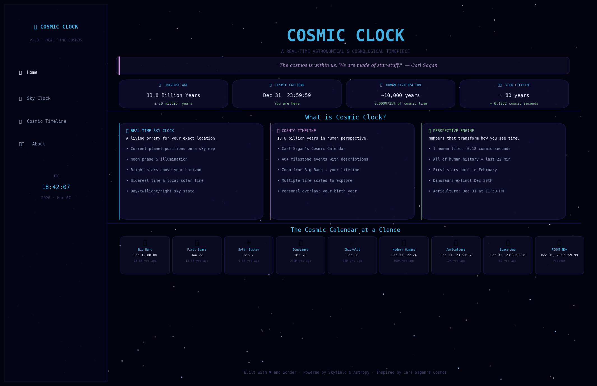
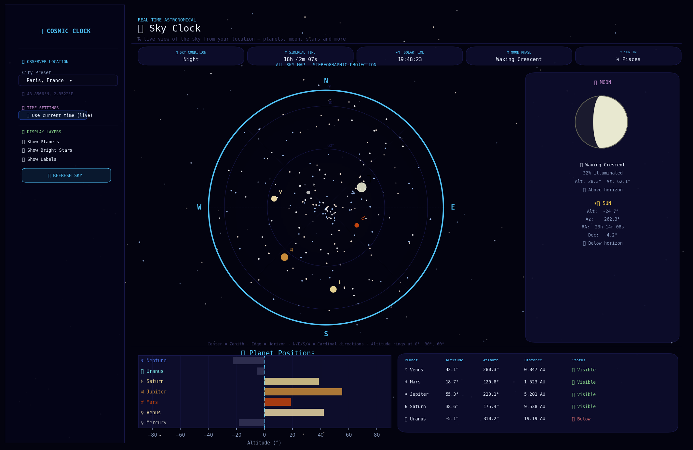
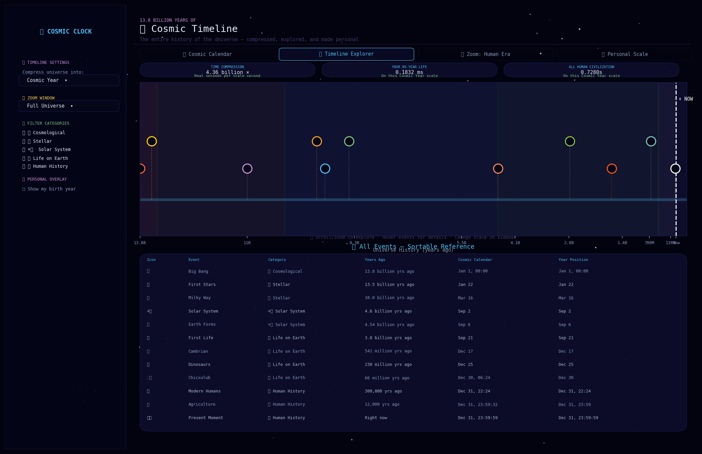
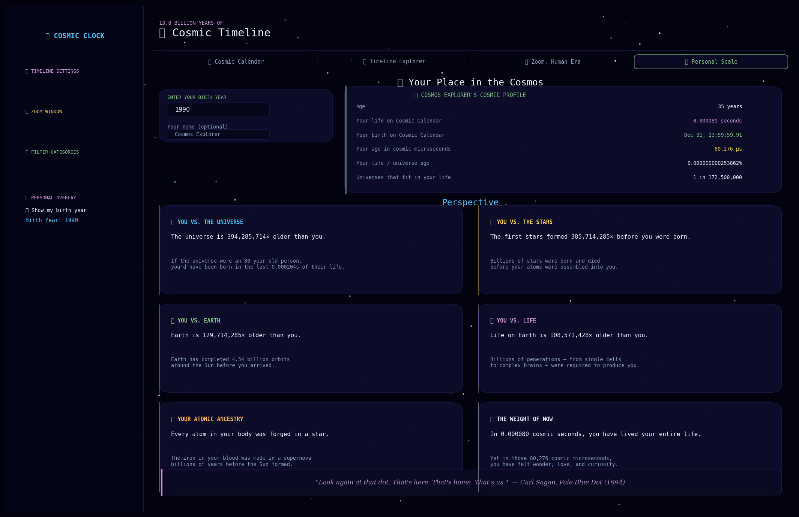

# Cosmic Clock

## For a data analyst application

**Do not use this as a data analyst sample.** It is a science visualization. The screenshots show the interface; they do not show KPI design, SQL, or a business decision.

A real-time astronomical and cosmological timepiece that connects the sky above the user with the 13.8-billion-year history of the universe.

## Product Experience

Cosmic Clock presents time at two scales:

1. **Immediate sky:** current positions of the Sun, Moon, planets, and bright stars for a selected location.
2. **Cosmic scale:** the history of the universe compressed into an interactive calendar and timeline.

## Application Preview

### Live Cosmic Dashboard

### Real-Time Sky Map

### Cosmic Timeline

### Personal Scale

## Features

- Orthographic all-sky map for a selected observer location (zenith at the center, horizon at the rim)
- Sun, Moon, and planet positions from the JPL DE421 ephemeris
- Moon phase and illumination from the Sun–Moon ecliptic elongation
- Bright-star catalogue with altitude, azimuth, magnitude, and constellation
- Apparent sidereal time and local apparent solar time
- Date/time override for historical or future sky views
- 45-event cosmological timeline with category filters
- Cosmic Calendar that maps 13.8 billion years onto a 365-day civil year
- Personalized comparison between a human lifetime and cosmic time

## Technical Architecture

| Layer | Implementation |
|---|---|
| Astronomy | Skyfield, Astropy, JPL DE421 ephemeris |
| Timeline | Custom cosmic-scaling and event logic |
| Visualization | Plotly |
| Application | Multi-page Streamlit |
| Data | JSON catalogues for events and bright stars |

## Run Locally

~~~bash
git clone https://github.com/ParBproject/-A-Real-Time-Astronomical-Cosmological-Timepiece-.git
cd ./-A-Real-Time-Astronomical-Cosmological-Timepiece-

python -m venv .venv
source .venv/bin/activate
pip install -r requirements.txt
streamlit run app.py
~~~

On first launch, Skyfield downloads the DE421 ephemeris (about 16 MB) and caches it under `~/skyfield-data`.

## Tests

~~~bash
pip install -r requirements-dev.txt
pytest
~~~

The tests pin the cosmic calendar, Julian dates (including leap years), Meeus sidereal time, and the Sun's zodiac longitude against published values, and compare live Sun, Moon, and solar-time results with Astropy and DE421.

## Repository Structure

~~~text
.
├── app.py
├── pages/
│   ├── 1_Sky_Clock.py
│   ├── 2_Cosmic_Timeline.py
│   └── 3_About.py
├── src/
│   ├── astronomy.py
│   ├── timeline.py
│   ├── visuals.py
│   └── utils.py
├── assets/
│   ├── events.json
│   └── constellations.json
├── tests/
├── requirements.txt
└── requirements-dev.txt
~~~

## Skills Demonstrated

Scientific Python, astronomical coordinate calculations, external scientific datasets, interactive visualization, multi-page application design, data modelling, numerical scaling, and accessible science communication.

## Accuracy Note

Sun, Moon, planet, zodiac, and solar-time calculations use Skyfield and the DE421 ephemeris. Sidereal time uses Astropy's apparent sidereal time. The cosmic calendar is not a second copy of a published poster: it maps 13.8 billion years onto a 365-day year (February has 28 days), and the timeline, home page, and About page all call that function.

If the ephemeris cannot be downloaded, the sky page switches to short low-precision formulas and says so. Those fallback positions are for the map, not for observing. Jupiter through Neptune are the planetary barycenters, which is what DE421 provides; the offset from the planet center is arcseconds.
